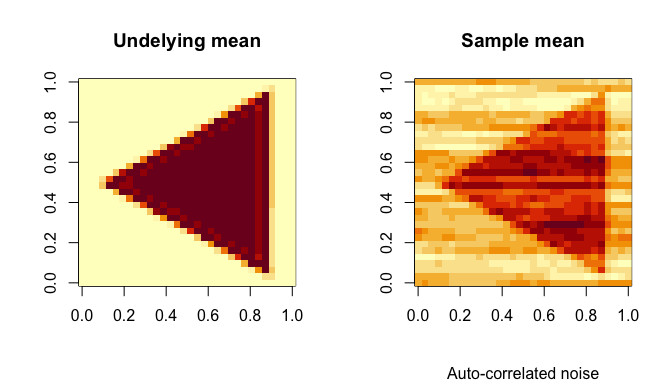
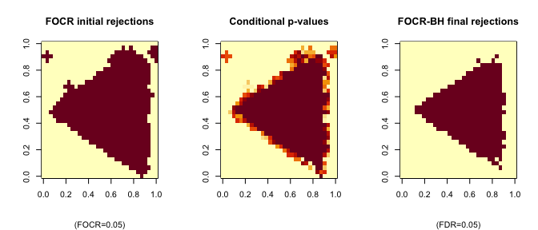

# False Overlapped-Cluster Rate (FOCR)

<!-- badges: start -->

[](https://lifecycle.r-lib.org/articles/stages.html#experimental)
[](https://CRAN.R-project.org/package=focr)
[](https://github.com/dipterix/focr/actions)
<!-- badges: end -->

A two-stage procedure to solve the following multiple testing problems
with topological constraints:

*H*<sub>0</sub>(*s*) : *μ*(*s*) = 0,  *H*<sub>1</sub>(*s*) : *μ*(*s*) ≠ 0

In functional data analysis, the underlying function *μ*(*s*) may be
subject to topological constraints (temporal, spatial, …). The
functional domain is also uncountable. It is scientifically meaningful
to extract blocks (clusters, or connected regions) of *s* such that
*H*<sub>0</sub>(*s*) are rejected. The FOCR framework controls the
type-I error in the following two stages:

-   Stage-I: given blocks of hypotheses, control the FOCR (an extended
    false cluster rate) at given level. This step is to find connected
    regions of interests. The FOCR is defined as: <br /><br />
    FOCR = 𝔼\[*V*/*R*×*I*<sub>{*R* &gt; 0}</sub>\],
    <br /><br /> where
    *V* = ∑<sub>*k*</sub>*ν*(*D*<sub>*k*</sub>)*R*(*B*<sub>*k*</sub>)(1 − *θ*(*B*<sub>*k*</sub>))
    and
    *R* = ∑<sub>*k*</sub>*ν*(*D*<sub>*k*</sub>)*R*(*B*<sub>*k*</sub>).
    *B*<sub>*k*</sub> are the overlapped clusters (blocks) and
    *D*<sub>*k*</sub> are the corresponding disjoint kernels;
-   Stage-II: given the previous rejection (clusters), calculate
    conditional p-values in a post-selection fashion. Then a further
    selection procedure will be applied to the conditional p-values to
    control the FDR (at individual level).

Please read
[vignettes](http://github.dipterix.org/focr/articles/false-overlapped-cluster-rate.html),
and [help
documents](http://github.dipterix.org/focr/reference/focr.html) for more
examples.

## Installation

You can install the released version of `focr` from
[CRAN](https://CRAN.R-project.org) with:

``` r
install.packages("focr")
```

And the development version from [GitHub](https://github.com/) with:

``` r
# install.packages("remotes")
remotes::install_github("dipterix/focr")
```

## Example

Let’s sample from this 2D image (`32x32` pixels). The underlying signal
is a triangle. The noise is generated with correlation.



Example code:

``` r
res <- focr(data, block_size = 3, alpha = 0.05, 
            fdr_method = 'BH', dimension = c(32,32))
```

The initial clusters, conditional p-values, and final rejections are
displayed as follows:



For detailed usage, please read
[vignettes](http://github.dipterix.org/focr/articles/false-overlapped-cluster-rate.html),
and [help
documents](http://github.dipterix.org/focr/reference/focr.html).

## Citations
